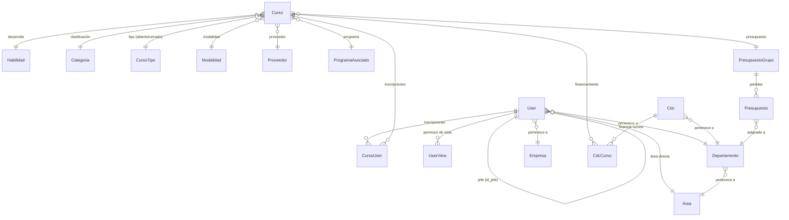
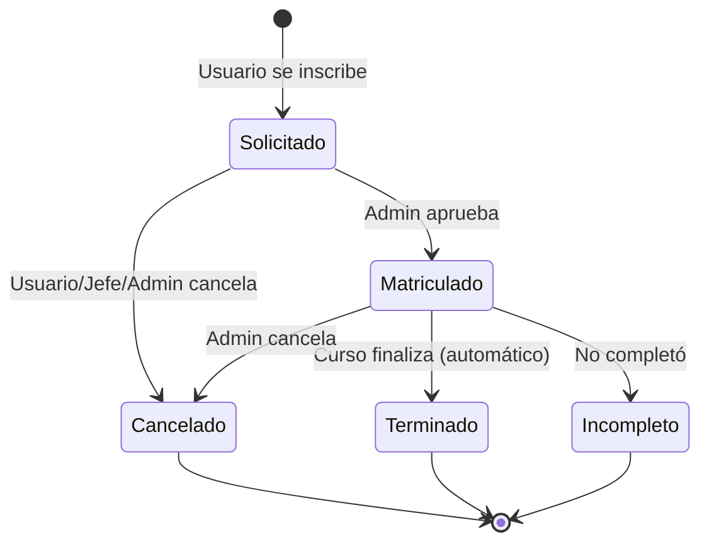

# Hub de Aprendizaje Tuteur (HAT) — Documentación del Proyecto

Plataforma de gestión de capacitaciones corporativas que permite administrar cursos, inscripciones, presupuestos y estructura organizacional.

---

## Tech Stack

| Capa | Tecnología |
|---|---|
| **Backend** | Laravel 11 (PHP 8.2+) |
| **Frontend** | React 19 + TypeScript + Inertia.js |
| **Build** | Vite |
| **UI Library** | Ant Design + Lucide Icons |
| **Estilos** | Tailwind CSS 4 con tokens custom (`app.css`) |
| **Auth** | Laravel Fortify + LDAP (Active Directory) |
| **2FA** | TOTP via Fortify `TwoFactorAuthenticatable` |
| **Notifications** | Sonner (toasts) + Laravel Mail (emails) |
| **DB** | MySQL / MariaDB |

---

## Estructura del Proyecto

```
capacitaciones2/
├── app/
│   ├── Http/
│   │   ├── Controllers/
│   │   │   ├── Web/                      # Controladores Inertia (renderizan páginas)
│   │   │   │   ├── AdminCphController     # Páginas admin (users, courses, structure, metrics)
│   │   │   │   ├── ColaboradorController  # Dashboard del colaborador
│   │   │   │   └── CourseController       # Catálogo de cursos (colaborador/jefe)
│   │   │   ├── Api/Admin/                 # API endpoints (JSON responses)
│   │   │   │   ├── AdminController        # CRUD cursos, users, enrollments, views
│   │   │   │   └── [Resource]Controller   # CRUD para cada recurso de estructura
│   │   │   └── Settings/                  # Configuración de perfil y contraseña
│   │   └── Middleware/
│   │       ├── CheckRole                  # Verifica rol del usuario
│   │       ├── CheckViewAccess            # Verifica acceso por vista (view_key)
│   │       ├── HandleInertiaRequests      # Comparte datos globales (auth, user_views, flash)
│   │       └── HandleAppearance           # Modo claro/oscuro
│   ├── Models/                            # 20 modelos Eloquent
│   ├── Services/
│   │   ├── EnrollmentService              # Lógica de inscripciones y estados
│   │   ├── CourseService                  # Filtros y transiciones automáticas
│   │   └── LdapService                   # Sincronización con Active Directory
│   └── Mail/                              # 7 Mailables (emails transaccionales)
├── resources/js/
│   ├── components/                        # 24 componentes React reutilizables
│   ├── pages/
│   │   ├── admincph/                      # 5 páginas admin
│   │   │   ├── dashboard.tsx              # Panel admin principal
│   │   │   ├── courses.tsx                # Gestión de cursos + inscripciones
│   │   │   ├── users.tsx                  # Gestión de usuarios + permisos de vistas
│   │   │   ├── structure.tsx              # Estructura organizacional (tabs)
│   │   │   └── metrics.tsx                # Métricas y reportes
│   │   ├── colaborador/
│   │   │   ├── dashboard.tsx              # Dashboard personal con cursos inscritos
│   │   │   └── courses/index.tsx          # Catálogo de cursos + solicitudes
│   │   ├── auth/                          # Login, register, forgot-password
│   │   └── settings/                      # Profile, password, appearance
│   ├── layouts/
│   │   └── app-layout.tsx                 # Layout principal con header + sidebar
│   └── types/                             # Tipos TypeScript compartidos
├── routes/
│   ├── web.php                            # Rutas principales con middleware view.access
│   ├── api.php                            # Rutas API (CRUD resources)
│   └── settings.php                       # Rutas de configuración del perfil
└── database/migrations/                   # Migraciones del esquema
```

---

## Modelos y Base de Datos

### Diagrama de Relaciones



### Modelos Principales

#### [User](file:///c:/www/capacitaciones2/app/Models/User.php#12-141) — Usuario del sistema
| Campo | Tipo | Descripción |
|---|---|---|
| `name`, `email`, `password` | string | Datos básicos (sincronizados desde LDAP) |
| `role` | string | [user](file:///c:/www/capacitaciones2/app/Models/UserView.php#11-15), `jefe_area`, `jefe_general`, `admin` |
| `cargo` | string | Cargo/posición laboral |
| `id_departamento` | FK → Departamento | Departamento al que pertenece |
| `id_empresa` | FK → Empresa | Empresa del grupo |
| `id_area` | FK → Area | Área directa |
| `id_jefe` | FK → User | **Jefe directo** (forma la cadena jerárquica) |
| `pais`, `ciudad`, `oficina` | string | Ubicación geográfica |

**Métodos clave:**
- [getAllSubordinateIds()](file:///c:/www/capacitaciones2/app/Models/User.php#58-73) — Obtiene **todos** los subordinados recursivamente bajando por la cadena `id_jefe`
- [isJefe()](file:///c:/www/capacitaciones2/app/Models/User.php#74-81) — `true` si tiene al menos un subordinado directo
- [hasViewAccess($key)](file:///c:/www/capacitaciones2/app/Models/User.php#82-107) — Verifica si tiene acceso a una vista específica
- [views()](file:///c:/www/capacitaciones2/app/Models/User.php#53-57) → `HasMany(UserView)` — Permisos de vista asignados
- [cursos()](file:///c:/www/capacitaciones2/app/Models/Cdc.php#21-25) → `BelongsToMany(Curso)` — Cursos en los que está inscripto

#### [Curso](file:///c:/www/capacitaciones2/app/Models/Curso.php#10-114) — Curso de capacitación
| Campo | Tipo | Descripción |
|---|---|---|
| `nombre`, `descripcion` | string | Datos del curso |
| `inicio`, [fin](file:///c:/www/capacitaciones2/app/Console/Commands/FreshImportFromExcel.php#285-295) | date | Período del curso |
| `horarios` | JSON array | Horarios (cast a array PHP) |
| `costo` | decimal | Costo total |
| `costo_cero` | boolean | Si es gratuito |
| `capacidad` | integer | Cupos disponibles (se decrementa al matricular) |
| `publicado` | boolean | Si es visible para colaboradores |
| `habilidad_id`, `categoria_id` | FK | Clasificación |
| `id_tipo` | FK → CursoTipo | `abierto` o `cerrado` |
| `id_modalidad` | FK → Modalidad | Presencial, virtual, etc. |
| `id_proveedor` | FK → Proveedor | Institución proveedora |
| `id_presupuesto` | FK → PresupuestoGrupo | Presupuesto que financia |

**Relaciones clave:**
- [users()](file:///c:/www/capacitaciones2/app/Http/Controllers/Api/Admin/AdminController.php#42-60) → Pivot `cursos_users` con `curso_estado` + `id_user_mod`
- [cdcs()](file:///c:/www/capacitaciones2/app/Models/Curso.php#99-108) → Pivot `cdc_curso` con `monto` (financiamiento multi-CDC)

#### [EstadoCurso](file:///c:/www/capacitaciones2/app/Models/EstadoCurso.php#7-13) — Estados de inscripción
Tabla lookup con un campo `estado`. Los estados posibles son:

| Estado | Descripción |
|---|---|
| `solicitado` | El usuario pidió inscribirse |
| `matriculado` | Admin aprobó la inscripción (decrementa capacidad) |
| `cancelado` | Cancelado por usuario, jefe o admin |
| `terminado` | Curso completado (automático al pasar fecha fin) |
| `incompleto` | No completó el curso (interrumpido) |

#### Jerarquía de Presupuestos (3 niveles)

```
PresupuestoGrupo (descripción + año)
  └── Presupuesto (monto inicial/actual por departamento)
        └── deduct() / restore() — gestión de montos
```

#### Estructura Organizacional

```
Empresa
Area
  └── Departamento
        └── CDC (Centro de Costo, con inversión)
```

---

## Sistema de Autenticación

### LDAP / Active Directory
- `LdapService` sincroniza usuarios desde Active Directory
- Se ejecuta manualmente desde el botón **"Sincronizar AD"** en `/admin/users`
- Mapea campos LDAP a campos del modelo [User](file:///c:/www/capacitaciones2/app/Models/User.php#12-141) (name, email, cargo, departamento, jefe, etc.)
- Crea usuarios nuevos o actualiza existentes basándose en el email

### Fortify
- Login/logout estándar via Fortify
- Soporte para **2FA** (TOTP) con modal de configuración
- Recovery codes disponibles

---

## Sistema de Permisos

### Roles (`User.role`)
| Rol | Acceso por defecto |
|---|---|
| `admin` | **Todo** — acceso completo automático |
| `jefe_general` | Dashboard |
| `jefe_area` | Dashboard |
| [user](file:///c:/www/capacitaciones2/app/Models/UserView.php#11-15) | Dashboard |

### Permisos de Vista (`user_views` table)

Además del rol, cada usuario puede tener acceso a vistas adicionales asignadas por un admin:

| View Key | Ruta | Descripción |
|---|---|---|
| [dashboard](file:///c:/www/capacitaciones2/app/Http/Controllers/Web/AdminCphController.php#19-31) | `/dashboard` | Siempre accesible para todos |
| [courses](file:///c:/www/capacitaciones2/app/Http/Controllers/Web/AdminCphController.php#102-177) | `/courses` | Catálogo de cursos (automático para jefes) |
| `admin.dashboard` | `/admin` | Panel admin |
| `admin.courses` | `/admin/courses` | Gestión de cursos |
| `admin.users` | `/admin/users` | Gestión de usuarios |
| `admin.structure` | `/admin/structure` | Estructura organizacional |
| `admin.metrics` | `/admin/metrics` | Métricas |

**Middleware [CheckViewAccess](file:///c:/www/capacitaciones2/app/Http/Middleware/CheckViewAccess.php#9-27):**
- Cada ruta tiene `->middleware('view.access:key')`
- Verifica `User::hasViewAccess($key)` → admin=true, dashboard=true para todos, courses=true para jefes, o busca en `user_views`

**Navegación dinámica:**
- [HandleInertiaRequests](file:///c:/www/capacitaciones2/app/Http/Middleware/HandleInertiaRequests.php#8-66) comparte `user_views` (array de keys accesibles)
- [app-header.tsx](file:///c:/www/capacitaciones2/resources/js/components/app-header.tsx) y [app-sidebar.tsx](file:///c:/www/capacitaciones2/resources/js/components/app-sidebar.tsx) filtran los ítems del menú según estos permisos
- Si no tiene ningún `admin.*` → no se muestra el dropdown "Administración"

**Gestión de permisos:**
- Modal en `/admin/users` con checkboxes por vista → `POST /admin/users/{id}/views`

---

## Flujo de Inscripciones (Enrollment Lifecycle)



### [EnrollmentService](file:///c:/www/capacitaciones2/app/Services/EnrollmentService.php#13-95)

**[enroll($user, $curso)](file:///c:/www/capacitaciones2/app/Services/EnrollmentService.php#15-34)**
1. Crea entrada en `cursos_users` con estado `solicitado`
2. Si el curso es tipo `abierto` → envía email [EnrollmentRequested](file:///c:/www/capacitaciones2/app/Mail/EnrollmentRequested.php#13-36)

**[updateState($user, $curso, $newState, $modifier)](file:///c:/www/capacitaciones2/app/Services/EnrollmentService.php#35-93)**
1. Valida transición:
   - Si `cancelado` por un jefe → regla de 7 días antes del inicio (DEV MODE: desactivada)
   - Si usuario intenta cancelar estando `matriculado` → bloqueado (solo admin puede)
2. Actualiza `curso_estado` en el pivot
3. **Gestión de capacidad:**
   - `→ matriculado`: `curso.capacidad--`
   - `matriculado →` cancelado/incompleto: `curso.capacidad++`
4. **Emails** (solo cursos tipo `abierto`):
   - `→ solicitado`: [EnrollmentRequested](file:///c:/www/capacitaciones2/app/Mail/EnrollmentRequested.php#13-36)
   - `→ matriculado`: `EnrollmentConfirmed`
   - `→ incompleto`: [EnrollmentCancelled](file:///c:/www/capacitaciones2/app/Mail/EnrollmentCancelled.php#13-55)

### Emails de rechazo (flujos separados)

| Origen | Mailable | Controlador |
|---|---|---|
| Jefe rechaza (desde `/courses`) | [EnrollmentRejected](file:///c:/www/capacitaciones2/app/Mail/EnrollmentRejected.php#13-41) | `AdminController::rejectEnrollment` |
| Admin cancela (desde `/admin/courses`) | [EnrollmentAdminCancelled](file:///c:/www/capacitaciones2/app/Mail/EnrollmentAdminCancelled.php#13-41) | `AdminController::updateStatus` |

---

## Visibilidad para Jefes (Catálogo `/courses`)

Los jefes ven **únicamente** cursos donde alguno de sus subordinados (recursivamente) está inscripto.

### Cadena Jerárquica
```
HAHN JONATHAN (jhahn@)
  ├── GALLUZZO FEDERICO (fgalluzzo@)
  │     └── ...subordinados de GALLUZZO
  ├── DUARTE VIAGGIO JUAN MANUEL (jmduarte@)
  ├── NIETO LUCIANO (lnieto@)
  │     ├── RUIZ OVEJERO JUAN IGNACIO
  │     ├── VILLEGAS CARRERA ANALIA LUCILA
  │     ├── WEISS CAROLINA NATALIA
  │     └── Yariel Sulroca
  └── ...cientos más
```

- `User::getAllSubordinateIds()` recorre recursivamente `id_jefe` → recolecta IDs de **todos** los niveles inferiores
- `CourseController::index()` filtra cursos con `whereHas('users', whereIn subordinateIds)`
- `AdminController::courseEnrollments()` filtra inscripciones del modal con la misma lógica
- El [CourseCard](file:///c:/www/capacitaciones2/resources/js/components/course-card.tsx#40-194) muestra badge "X colaboradores" con la cantidad de subordinados inscriptos por curso

---

## Tareas Programadas (Scheduler)

Definidas en [bootstrap/app.php](file:///c:/www/capacitaciones2/bootstrap/app.php):

| Comando | Frecuencia | Descripción |
|---|---|---|
| `courses:process-workflows` | Diario | Ejecuta `CourseService::processCourseTransitions()`: marca cursos como terminados y envía emails de confirmación 6 días antes del inicio |
| `courses:auto-terminate` | Diario | Terminación automática de cursos finalizados |

---

## Rutas Principales ([web.php](file:///c:/www/capacitaciones2/routes/web.php))

### Públicas
| Método | Ruta | Descripción |
|---|---|---|
| GET | `/` | Welcome / Login |

### Autenticadas (con `view.access` middleware)
| Método | Ruta | Middleware | Descripción |
|---|---|---|---|
| GET | `/dashboard` | — | Dashboard colaborador |
| GET | `/courses` | `view.access:courses` | Catálogo de cursos |
| POST | `/courses/{id}/enroll` | `view.access:courses` | Inscribirse a un curso |
| POST | `/courses/{id}/cancelado` | `view.access:courses` | Cancelar inscripción |

### Admin (cada una con su `view.access`)
| Método | Ruta | Middleware | Descripción |
|---|---|---|---|
| GET | `/admin` | `view.access:admin.dashboard` | Dashboard admin |
| GET | `/admin/users` | `view.access:admin.users` | Gestión de usuarios |
| GET | `/admin/courses` | `view.access:admin.courses` | Gestión de cursos |
| GET | `/admin/structure` | `view.access:admin.structure` | Estructura organizacional |
| GET | `/admin/metrics` | `view.access:admin.metrics` | Métricas |

### API Admin (sin middleware de vista adicional)
| Método | Ruta | Descripción |
|---|---|---|
| POST | `/admin/courses` | Crear curso |
| PATCH | `/admin/courses/{id}` | Editar curso |
| DELETE | `/admin/courses/{id}` | Eliminar curso |
| POST | `/admin/users` | Crear usuario |
| PATCH | `/admin/users/{id}` | Editar usuario |
| POST | `/admin/users/sync-ad` | Sincronizar LDAP |
| GET/POST | `/admin/users/{id}/views` | Gestionar permisos de vista |
| POST | `/admin/enrollments/update-status` | Cambiar estado inscripción |
| POST | `/admin/enrollments/reject` | Rechazar inscripción |
| POST | `/admin/courses/{id}/enroll-manual` | Inscripción manual |
| GET | `/admin/courses/{id}/enrollments` | Listar inscripciones de un curso |
| DELETE | `/admin/enrollments/{id}` | Eliminar inscripción |
| POST/PATCH/DELETE | `/admin/structure/{type}[/{id}]` | CRUD de recursos de estructura |

---

## Componentes Frontend Clave

| Componente | Ubicación | Descripción |
|---|---|---|
| `AppLayout` | `layouts/app-layout.tsx` | Layout con header + sidebar responsivo |
| [AppHeader](file:///c:/www/capacitaciones2/resources/js/components/app-header.tsx#60-222) | [components/app-header.tsx](file:///c:/www/capacitaciones2/resources/js/components/app-header.tsx) | Navbar con menú dinámico según permisos |
| [AppSidebar](file:///c:/www/capacitaciones2/resources/js/components/app-sidebar.tsx#11-72) | [components/app-sidebar.tsx](file:///c:/www/capacitaciones2/resources/js/components/app-sidebar.tsx) | Sidebar con ítems filtrados por permisos |
| [CourseCard](file:///c:/www/capacitaciones2/resources/js/components/course-card.tsx#40-194) | [components/course-card.tsx](file:///c:/www/capacitaciones2/resources/js/components/course-card.tsx) | Card de curso con estado, acciones, y badge de equipo |
| `AltaCursoModal` | [components/AltaCursoModal.tsx](file:///c:/www/capacitaciones2/resources/js/components/AltaCursoModal.tsx) | Modal de creación/edición de cursos (53KB, muy completo) |
| `UserMenuContent` | [components/user-menu-content.tsx](file:///c:/www/capacitaciones2/resources/js/components/user-menu-content.tsx) | Menú del usuario (perfil, 2FA, logout) |
| [TwoFactorSetupModal](file:///c:/www/capacitaciones2/resources/js/components/two-factor-setup-modal.tsx#209-318) | [components/two-factor-setup-modal.tsx](file:///c:/www/capacitaciones2/resources/js/components/two-factor-setup-modal.tsx) | Configuración de 2FA con QR |

---

## Gestión de Presupuestos

### Flujo de Financiamiento
1. Se crean **Grupos de Presupuesto** ([PresupuestoGrupo](file:///c:/www/capacitaciones2/resources/js/types/capacitaciones.ts#63-71)) → año + descripción
2. Dentro de cada grupo, se asignan **montos por departamento** ([Presupuesto](file:///c:/www/capacitaciones2/app/Models/Presupuesto.php#9-52))
3. Al crear un curso, se le asignan **uno o más CDCs** con montos específicos
4. Al matricular usuarios, el costo se **deduce** del presupuesto del departamento correspondiente
5. Al cancelar, el monto se **restaura**

### Estructura en `/admin/structure`
Maneja tabs con CRUD para:
- Empresas, Áreas, Departamentos, CDCs
- Categorías, Habilidades, Proveedores
- Programas Asociados, Presupuestos (jerárquico 3 niveles)

---

## Emails Transaccionales

| Mailable | Cuándo se envía | Template |
|---|---|---|
| [EnrollmentRequested](file:///c:/www/capacitaciones2/app/Mail/EnrollmentRequested.php#13-36) | Usuario solicita inscripción (curso abierto) | [emails/enrollments/requested.blade.php](file:///c:/www/capacitaciones2/resources/views/emails/enrollments/requested.blade.php) |
| `EnrollmentConfirmed` | Admin aprueba inscripción / 6 días antes del inicio | `emails/enrollments/confirmed.blade.php` |
| [EnrollmentCancelled](file:///c:/www/capacitaciones2/app/Mail/EnrollmentCancelled.php#13-55) | Estado → incompleto (curso abierto) | `emails/enrollments/cancelled.blade.php` |
| [EnrollmentRejected](file:///c:/www/capacitaciones2/app/Mail/EnrollmentRejected.php#13-41) | Jefe rechaza desde `/courses` | [emails/enrollments/rejected.blade.php](file:///c:/www/capacitaciones2/resources/views/emails/enrollments/rejected.blade.php) |
| [EnrollmentAdminCancelled](file:///c:/www/capacitaciones2/app/Mail/EnrollmentAdminCancelled.php#13-41) | Admin cancela desde `/admin/courses` | [emails/enrollments/admin-cancelled.blade.php](file:///c:/www/capacitaciones2/resources/views/emails/enrollments/admin-cancelled.blade.php) |
| `CourseFinished` | Curso terminado (transición automática) | `emails/courses/finished.blade.php` |
| `StatusUpdated` | Cambio genérico de estado | `emails/enrollments/status-updated.blade.php` |

---

## Cómo Ejecutar el Proyecto

```bash
# Instalar dependencias
composer install
npm install

# Configurar .env (DB, LDAP, MAIL)
cp .env.example .env
php artisan key:generate

# Migraciones
php artisan migrate

# Dev server
npm run dev          # Vite (frontend)
php artisan serve    # Laravel (backend)
```

### Variables de Entorno Clave
- `DB_*` — Conexión a MySQL/MariaDB
- `LDAP_*` — Configuración Active Directory para sync
- `MAIL_*` — Configuración SMTP para emails transaccionales
